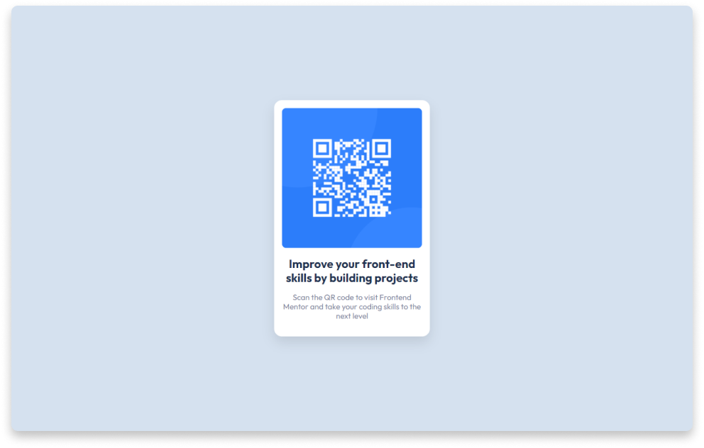

# QR component

> This is a solution to the [QR code component challenge on Frontend Mentor](https://www.frontendmentor.io/challenges/qr-code-component-iux_sIO_H).

I created it to improve my frontend skills 😃

## Built With

- HTML
- CSS (BEM)

## Live Demo

[Live Demo Link](https://qr-component-masud.netlify.app/)

## Authors

👤 **Maqsud**

- GitHub: [@maqsudtolipov](https://github.com/maqsudtolipov)
- Twitter: [@maqsud_tolipov](https://twitter.com/maqsud_tolipov)
- LinkedIn: [Maqsud Tolipov](https://linkedin.com/in/maqsud-tolipov)

## 🤝 Contributing

Contributions, issues, and feature requests are welcome!

Feel free to check the [issues page](../../issues/).

## Show your support

Give a ⭐️ if you like this project!

## 📝 License

This project is [MIT](./MIT.md) licensed.
